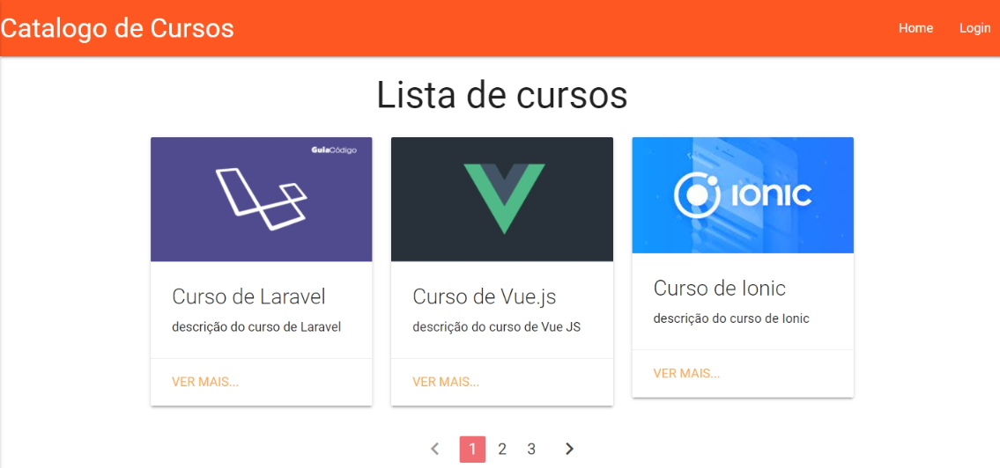

<p align="center">
    
</p>

<h1 align="center"> Catálogo de Cursos com Laravel</h1>

<p align="center">
    <a href="#sobre">Sobre</a> • 
    <a href="#features">Features</a> • 
    <a href="#demo">Demo</a> • 
    <a href="#pre-requisitos">Pré-requisitos</a> • 
    <a href="#tecnologias">Tecnologias</a> • 
    <a href="#licenca">Lincença</a> • 
    <a href="#autor">Autor</a> 
</p>

### Sobre

Catálogo de cursos é uma aplicação web feito com o [Framework PHP Laravel](https://laravel.com/). Nessa aplicação foi realizado na prática os principais conceitos desse Framework que é um dos mais utilizado no mundo PHP. Realizado um CRUD completo com o Laravel na sua versão 5.3. Instalado e configurado o projeto com Laravel, trabalhado com Rotas, utilizado template Blade, Migrations e implementado um sistema de Login com Laravel.

### Caracteristicas principais

- [x] Login de usuário
- [x] Cadastro de cursos
- [x] Editar cursos
- [x] Deletar cursos
- [x] Listagem dos cursos cadastrados
- [x] Páginação

### Demo
<h1 align="center">
    
</h1>

<p align="right">
<sub>(Preview)</sub>
</p>

### Pre-requisitos

Antes de começar, você vai precisar ter instalado em sua máquina as seguintes ferramentas: [Git](https://git-scm.com/), [Composer](https://getcomposer.org/), [Framework PHP Laravel](https://laravel.com/). Além disto é bom ter um editor para trabalhar com o código como [VsCode](https://code.visualstudio.com/)

### 👨🏻‍💻 Rodando o Back End

```bash
# Clone este repositório
$ git clone https://github.com/JuniorLima22/catalogoDeCursos-Laravel.git

# Acesse a pasta do projeto no terminal/cmd
$ cd catalogoDeCursos

# Instale as dependências
$ composer install

# criar arquivo .env (pode copiar de .env.example)

# Configure suas variáveis ​​de banco de dados em .env

# Criar um novo esquema no Banco de Dados MySql

# Gerar nova chave
$ php artisan key:generate

# Executar migrations
$ php artisan migrate

# Criar usuário master 
# usuário: admin@email.com e senha: 123456
$ php artisan db:seed --class=UsuarioSeeder

# Execute a aplicação
$ php artisan serve

# O servidor iniciará na porta:8000 - acesse <http://localhost:8000>
```
### Tecnologias

As seguintes ferramentas 🛠 foram usadas na construção do projeto:

<table>
    <tr>
        <td><a href="https://www.php.net/">PHP</a></td>
        <td><a href="https://getcomposer.org/"> Composer</a></td>
        <td><a href="https://laravel.com/">Laravel</a></td>
        <td><a href="https://www.mysql.com/">MySql</a></td>
        <td><a href="https://materializecss.com/">Materialize</a></td>
    </tr>
    <tr>
        <td>7.4.*</td>
        <td>2.0.*</td>
        <td>5.3.*</td>
        <td>6.0.*</td>
        <td>0.100.2</td>
    </tr>
</table>

### Licenca

O catálogo de produtos é um software de código aberto licenciado sob a [MIT license](http://opensource.org/licenses/MIT).

### Referencias

- Udemy

    - [Curso de Introdução ao framework PHP Laravel](https://www.udemy.com/share/101wM23@u-4bc3KSkVgsb-40OxE3AeUg-Trs17MknY8WPJIqRwmX2MQFLbZs8ayDw0X52ml0/) com instrutor [Guilherme Ferreira](https://www.udemy.com/user/guilherme-ferreira-4/)
- Criação do readme
    - Canal no Youtuber [Arthur PC](https://youtu.be/hzXNrOTM3VY) 👏🏻👏🏻
    - Canal no Youtuber [Programador Alternativo](https://youtu.be/HJ16WEmOWTw) 👏🏻👏🏻

### Autor

> Made with 💙 by JUNIOR LIMA 👋 [See my LinkedIn](https://www.linkedin.com/in/junior-lima-495108208/) • GitHub [@JuniorLima22](https://github.com/JuniorLima22)
